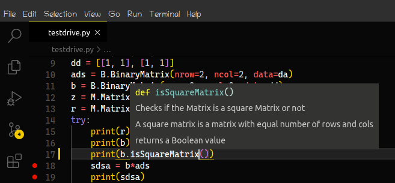

# *Pyrix* 

Well often times in the process of evolution we come across new stuff. Pyrix is one of them .
Pyrix is a Clean-Room implemented *Module/Library* which allows for improved , More intuitive Operations with Matrices and some of its related Fields such as vectors and linear Algebra.

### Why Pyrix?
As computaional Mathematics has evolved we have reached a stage where traditional pen/paper mathematics is becoming more of a tradition . For example in the recent courses at MIT for Linear Algebra-18.06 Most lectures are focused on explaining abstract ideas and methods . For the most Part Computers have proven to be a lot faster to do large computations and with a precise,accurate solution.  
I pitch Pyrix to be a Well implemented,Fast Performing Library to enable other students to learn Linear Algebra and Matrix Mathematics alongside. Being a student it's often a struggle to adopt to computational mathematics. Some courses leave students at an abstract view of concepts and its always upto the student to explore further.   
With pyrix being Open-Source One can easily view the source code , understand how the matrix operations are performed within the computer . Pyrix has been written with clean Documentation and Comments as it is intended to be viewed Multiple times.I encourage Students and anyone who is interested in matrix and linear algebra to look under the hood of pyrix and get an essence of implementation.   
For others who want to use all the features of pyrix in their programs , just install and import the package in your code. Documentation is thoroughly provided here. 

### Getting Started with Pyrix

For Python3 enviornment one can install the package with pip  
```
$ pip install pyrix
```  
\* some operating systems see pip for python2 and pip3 for python3 ,in that case  
```
$ pip3 install pyrix
```  


As for the support for IDE's most of my time was spent of VS-Code so most of the Method highlights and code suggestions should work in VS-Code   
  

