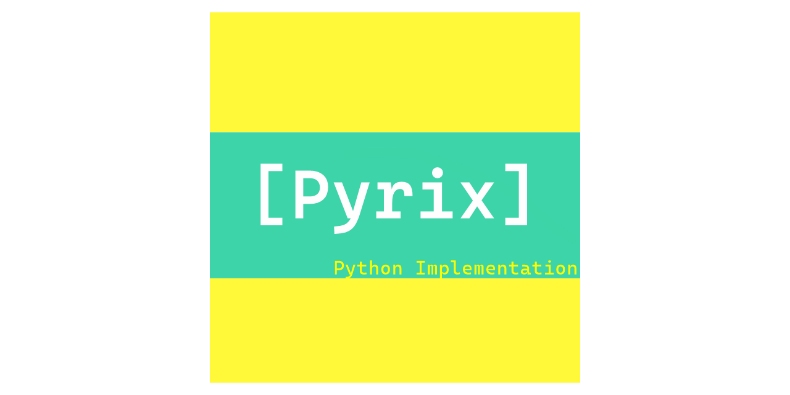

# **Pyrix** : The Minimalist Matrix Library
[](https://pypi.org/project/pyrix/#description)
[](https://github.com/Abhi-1U/pyrix/blob/master/LICENSE)
[](https://pypi.org/project/pyrix/#description)
[](https://github.com/psf/black)
[](https://pepy.tech/project/pyrix)
[](https://codecov.io/gh/Abhi-1U/pyrix)
[](https://travis-ci.org/Abhi-1U/pyrix)  
### A different take on Matrices
Matrices are everywhere and the central most important aspect of computing. Be
it graphics, AI or cryptography Matrix plays an important role and Pyrix takes
on with the pure Python matrix implementation.

### Why Pyrix?
As computaional Mathematics has evolved we have reached a stage where
traditional pen/paper mathematics is becoming more of a tradition. For example
in the recent courses at MIT for Linear Algebra-18.06 Most lectures are focused
on explaining abstract ideas and methods. For the most Part Computers have
proven to be a lot faster to do large computations and with a precise, accurate
solution.  
I pitch Pyrix to be a Well implemented, Fast Performing Library to enable other
students to learn Linear Algebra and Matrix Mathematics alongside. Being a
student it's often a struggle to adopt to computational mathematics. Some
courses leave students at an abstract view of concepts and its always upto the
student to explore further.   
With pyrix being Open-Source One can easily view the source code, understand how
 the matrix operations are performed within the computer.
### Getting Started with Pyrix

For Python3 enviornment one can install the package with pip  
```
$ pip install pyrix
```  
\* some operating systems see pip for Python2 and pip3 for Python3 ,in that case  
```
$ pip3 install pyrix
```  
