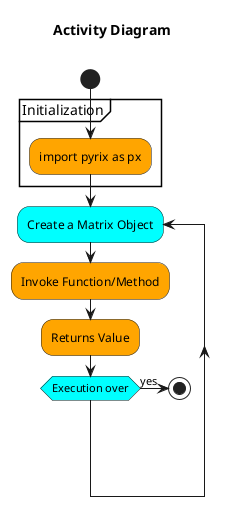
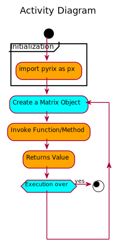

# Activity Diagram
 This is generated in Plant UML
## Source code 

```plantuml
@startuml
!pragma useVerticalIf on
title Activity Diagram \n
start
partition Initialization {
    #Orange:import pyrix as px;
}
#Cyan:repeat :Create a Matrix Object;
#Orange:Invoke Function/Method;
#Orange:Returns Value;
#Cyan:if (Execution over) then (yes)
  stop
@enduml
```

## SVG file
